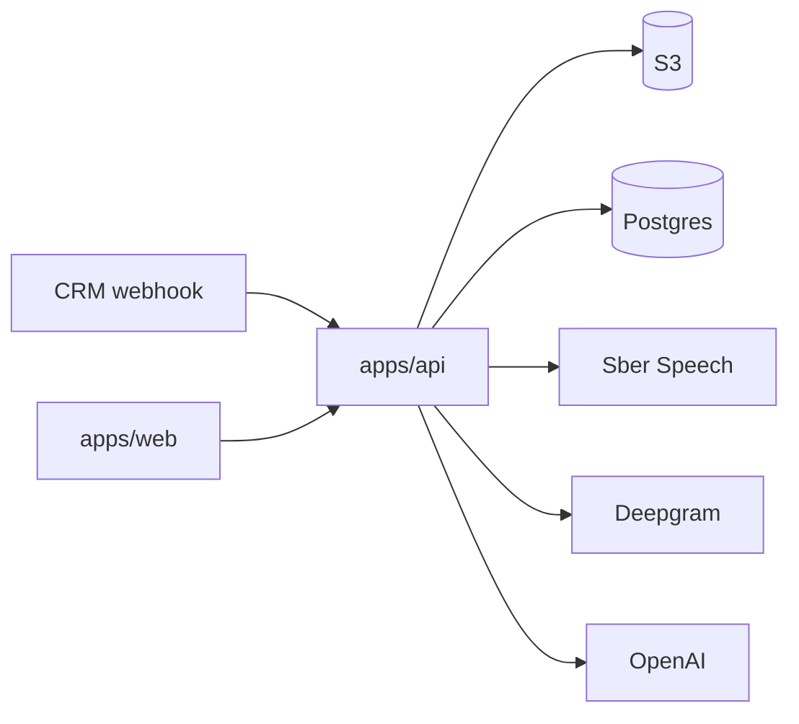

# Сводка по системе Ecookna CRM Analytics

Документ предназначен для передачи заказчику и включает и бизнес-обзор, и техническую справку для ИТ-службы.

## Назначение системы

Система собирает данные о звонках из CRM, сохраняет аудиофайлы, автоматически анализирует их и показывает результаты в интерфейсе аналитики.

Система используется для:
- оценки качества разговоров;
- просмотра транскрипции и ключевых метрик;
- управления системными промптами для анализа;
- управления учетными записями и ролями пользователей.

## Основные пользовательские сценарии

Для бизнес-пользователей:
- войти в систему;
- открыть список звонков;
- отфильтровать звонки по сотруднику, отделу, бренду и результату;
- открыть карточку звонка и посмотреть транскрипцию, оценки и речевые метрики;
- удалить запись звонка, если у пользователя есть права администратора;
- перейти по ссылке на внешний отчет по отклоненным лидам.

Для администраторов:
- управлять системными промптами;
- создавать, редактировать и отключать пользователей;
- назначать роли `admin` и `call_center`;
- сбрасывать или задавать пароль пользователю.

Для ИТ-службы:
- развернуть web и API;
- обеспечить доступ к Postgres, S3, Sber Speech, Deepgram и OpenAI;
- контролировать логи, cron-обработчики и статус очереди в БД;
- поддерживать переменные окружения и секреты.

## Роли пользователей и зоны ответственности

| Роль | Что доступно |
| --- | --- |
| `admin` | Аналитика, карточки звонков, админ-панель, промпты, пользователи, удаление записей |
| `call_center` | Аналитика и карточки звонков без админ-панели |

В коде есть cookie-based аутентификация и проверка роли на уровне API и UI.

## Технический стек

| Слой | Технологии |
| --- | --- |
| Frontend | React 18, TypeScript, Vite, React Router, TanStack Query, React Hook Form, Zod, Tailwind CSS, shadcn/ui |
| Backend | Node.js, Express 5, pg, multer, node-cron, AWS SDK for S3, music-metadata |
| Общие пакеты | `@ecookna/shared-types`, `@ecookna/api-client` |
| Хранилище данных | Postgres |
| Файлы | S3-compatible storage |
| Внешние ML/AI сервисы | Sber Speech, Deepgram, OpenAI |

## Архитектура системы



Особенности:
- фронтенд и API работают в одном монорепозитории;
- API обслуживает webhook, аутентификацию, CRUD по звонкам, промптам и пользователям;
- фоновые обработчики запускаются внутри того же Node.js-процесса через `node-cron`;
- очереди и брокера сообщений нет, отбор задач выполняется через `claim`-запросы в Postgres.

## Описание модулей и сервисов

| Модуль | Назначение |
| --- | --- |
| `apps/web` | UI аналитики звонков, просмотр деталей, вход, админ-панель |
| `apps/api` | HTTP API, webhook ingestion, auth, фоновые обработки, работа с БД и внешними сервисами |
| `packages/shared-types` | Общие интерфейсы DTO между frontend и API |
| `packages/api-client` | Унифицированные HTTP-вызовы фронтенда к API |

## Пользовательский интерфейс

Основной экран показывает:
- KPI по звонкам;
- список карточек звонков;
- фильтры по результату, сотруднику, отделу и бренду;
- пагинацию;
- боковую панель с деталями выбранного звонка.

Карточка звонка показывает:
- дату и время;
- сотрудника;
- бренд;
- подразделение;
- тип звонка;
- статус обработки;
- общую оценку.

В детальной панели доступны:
- транскрипция разговора;
- критерии качества;
- оценки по этапам и регламенту;
- риск конфликта;
- эмоциональные и речевые показатели, если они пришли от Sber;
- служебные поля анализа.

## Административный интерфейс

Админ-панель состоит из двух разделов:
- промпты;
- пользователи и доступ.

Раздел промптов позволяет:
- посмотреть список промптов;
- открыть полный текст;
- редактировать текст и название;
- удалить промпт.

Раздел пользователей позволяет:
- увидеть список учетных записей;
- создать пользователя;
- поменять роль;
- включить или отключить учетную запись;
- задать или обновить пароль;
- удалить пользователя.

## Структура базы данных и модели данных

### Основные таблицы

| Таблица | Назначение |
| --- | --- |
| `crm_analytics` | Основной поток аналитики звонков |
| `disaproov_calls` | Поток звонков с отказами / отклоненными лидами |
| `prompts` | Системные промпты для OpenAI |
| `app_users` | Пользователи и роли |
| `auth_sessions` | Cookie-сессии |

### Что хранится в `crm_analytics`

Ключевые группы полей:
- идентификаторы и метаданные звонка: `call_id`, `call_datetime`, `user_name`, `department`, `brand`, `call_type`;
- файлы и статус обработки: `file_name`, `file_url`, `file_status`, `uploaded_at`, `analyzed_at`;
- результаты анализа: `transkription`, `transkription_full_json`, `openai_full_json`;
- оценки и признаки качества: `overall_score`, `call_success`, `stages_score`, `quality_score`, `compliance_score`, `conflict_risk_score`, булевы критерии диалога;
- метрики речи и эмоций: `csi_score`, `dialog_agent_speech_percentage`, `customer_emo_score_mean` и связанные поля;
- retry-поля: `retry_count`, `next_retry_at`, `last_error`, `processing_started_at`.

### Что хранится в `disaproov_calls`

Ключевые группы полей:
- метаданные звонка и клиента;
- `file_url`, `file_name`;
- `reject_reasons` как JSON;
- `webhook_payload_json`, `webhook_payload_text`;
- `deepgram_full_json`, `openai_full_json`;
- retry-поля аналогично основному потоку.

### Что хранится в `prompts`

- `prompt_key`;
- `prompt_name`;
- `prompt_text`;
- `created_at`.

### Что хранится в `app_users` и `auth_sessions`

- `app_users` хранит email, имя, роль, статус активности и hash пароля;
- `auth_sessions` хранит hash сессионного токена, срок жизни и время последнего использования.

## API и интеграции

### Внутренние HTTP-ручки

| Метод | Путь | Назначение |
| --- | --- | --- |
| `GET` | `/health` | Проверка живости сервиса |
| `POST` | `/webhook/getcrmdata` | Прием аудио и полей звонка |
| `POST` | `/api/webhook/getcrmdata` | Тот же webhook по API-алиасу |
| `POST` | `/auth/login` | Вход |
| `POST` | `/auth/logout` | Выход |
| `GET` | `/auth/me` | Текущий пользователь |
| `GET` | `/auth/users` | Список пользователей, только админ |
| `POST` | `/auth/users` | Создание пользователя, только админ |
| `PATCH` | `/auth/users/:id` | Обновление пользователя, только админ |
| `DELETE` | `/auth/users/:id` | Удаление пользователя, только админ |
| `GET` | `/api/crm/calls` | Список звонков |
| `GET` | `/api/crm/calls/:id` | Детали звонка |
| `DELETE` | `/api/crm/calls/:id` | Удаление звонка, только админ |
| `DELETE` | `/api/crm/calls/latest` | Массовое удаление последних звонков, только админ |
| `GET` | `/api/crm/metrics` | KPI по звонкам |
| `GET` | `/api/prompts` | Список промптов, только админ |
| `PATCH` | `/api/prompts/:id` | Изменение промпта, только админ |
| `DELETE` | `/api/prompts/:id` | Удаление промпта, только админ |

### Внешние сервисы

| Сервис | Назначение |
| --- | --- |
| S3-compatible storage | Хранение аудиофайлов |
| Sber Speech | Распознавание и дополнительные инсайты по звонку |
| Deepgram | Транскрибация потока отказов |
| OpenAI | Структурированная оценка звонков и причин отказа |
| Postgres | Основные данные, пользователи, сессии и рабочие очереди |

### Внешняя BI-ссылка

В шапке фронтенда есть ссылка на внешний отчет по отклоненным лидам. Адрес закреплен в коде и должен считаться внешней зависимостью интерфейса.

## Внешние зависимости

- S3 bucket и ключи доступа;
- Postgres для основной БД;
- отдельный Postgres для `disaproov_calls`, если он не хранится вместе с основной БД;
- Sber Speech;
- Deepgram;
- OpenAI;
- внешний BI-дашборд для отклоненных лидов.

## Переменные окружения

### Frontend

| Переменная | Назначение |
| --- | --- |
| `VITE_API_BASE_URL` | Базовый URL API, по умолчанию используется `/api` |

### Backend и общие

| Переменная | Назначение |
| --- | --- |
| `ENV_FILE` | Путь к файлу env для `dotenv` |
| `NODE_ENV` | Режим выполнения |
| `PORT` | Порт API |
| `DB_MAIN_URL` / `DB_URL` | Основная строка подключения к Postgres |
| `DB_DISAPPROVE_URL` | Отдельная строка подключения для `disaproov_calls`, опционально |
| `AUTH_COOKIE_NAME` | Имя cookie сессии |
| `AUTH_SESSION_DAYS` | Срок жизни сессии в днях |
| `CRM_WEBHOOK_PATH` | Используется в логах старта, маршрут в коде не переопределяет |
| `CRM_WEBHOOK_MAX_FILE_AGE_DAYS` | Присутствует в примерах, но текущий код не читает |
| `CRON_ENABLED` | Включает/выключает cron-обработчики |
| `CRON_MAIN` | Расписание основного воркера |
| `CRON_DISAPPROVE` | Расписание воркера отклоненных звонков |
| `RETRY_MAX_ATTEMPTS` | Максимум повторов |
| `RETRY_BACKOFF_MS` | Базовая задержка retry |
| `MAIN_BATCH_LIMIT` | Размер пачки основного воркера |
| `DISAPPROVE_BATCH_LIMIT` | Размер пачки второго воркера |
| `MIN_CALL_DURATION_SECONDS` | Минимальная длина звонка для приема |
| `S3_ENDPOINT` | Endpoint S3 |
| `S3_REGION` | Регион S3 |
| `S3_BUCKET` | Bucket |
| `S3_ACCESS_KEY_ID` | Access key |
| `S3_SECRET_ACCESS_KEY` | Secret key |
| `SBER_AUTH_KEY` | Basic auth key для Sber |
| `SBER_SCOPE` | Scope для Sber OAuth |
| `SBER_MODEL` | Модель распознавания |
| `SBER_INSIGHT_MODELS` | Подключаемые insight-модели |
| `SBER_OAUTH_URL` | URL OAuth Sber |
| `SBER_UPLOAD_URL` | URL upload Sber |
| `SBER_RECOGNIZE_URL` | URL async recognize Sber |
| `SBER_TASK_URL` | URL polling задачи Sber |
| `SBER_DOWNLOAD_URL` | URL download результата Sber |
| `SBER_SAMPLE_RATE` | Опциональная фиксированная частота дискретизации |
| `SBER_CHANNELS_COUNT` | Опциональное число каналов |
| `SBER_POLL_INTERVAL_MS` | Интервал опроса задачи Sber |
| `SBER_POLL_TIMEOUT_MS` | Таймаут ожидания задачи Sber |
| `DEEPGRAM_API_KEY` | Токен Deepgram |
| `DEEPGRAM_URL` | URL API Deepgram |
| `OPENAI_API_KEY` | Ключ OpenAI |
| `OPENAI_MODEL` | Модель OpenAI |
| `OPENAI_URL` | URL OpenAI API |

## Локальный запуск

1. Установить зависимости:

```bash
pnpm install
```

2. Подготовить env:

```bash
cp apps/api/.env.example apps/api/.env
cp apps/web/.env.example apps/web/.env
```

3. Запустить оба приложения:

```bash
pnpm dev
```

Дополнительно:
- `pnpm dev:api` - только API;
- `pnpm dev:web` - только фронтенд.

Для локального фронтенда Vite использует прокси `/api -> http://127.0.0.1:3000`.

## Сборка и деплой

### Локальная сборка

- `pnpm build` - сборка всех пакетов и приложений;
- `pnpm --filter @ecookna/web build` - сборка фронтенда;
- `pnpm --filter @ecookna/api start` - запуск API в production-режиме.

### Docker

- `apps/api/Dockerfile` собирает API-контейнер;
- `apps/web/Dockerfile` собирает web-контейнер на nginx;
- `apps/api/docker-compose.yml` поднимает API и healthcheck.

### Dokploy

Ожидаемая схема публикации:
- web на публичном `/`;
- API на `/api`;
- один origin для UI и API;
- отдельные секреты и runtime-переменные для API.

## Мониторинг и диагностика

Что есть сейчас:
- `GET /health`;
- JSON-логи в stdout;
- лог старта сервиса;
- лог отключенного cron;
- лог успешного/неуспешного выполнения воркеров;
- статус очереди в БД через `file_status`, `retry_count`, `next_retry_at`, `last_error`.

Чего нет в коде:
- отдельного exporter'а метрик;
- отдельного queue dashboard;
- централизованного tracing.

## Безопасность и доступы

- сессия хранится в HttpOnly cookie;
- cookie использует `SameSite=Lax`, а в production добавляется `Secure`;
- все изменения пользователей и промптов доступны только админу;
- удаление звонков также ограничено админом;
- в UI админ-панель не показывается пользователю без роли `admin`.

Что стоит учитывать:
- CSRF-токенов в коде нет;
- HTML-предпросмотр промптов использует простую подстановку HTML и должен оставаться только в админском контуре;
- `delete` по звонкам удаляет запись из БД, а очистка объекта в S3 делается best effort.

## Ограничения текущей реализации

- фильтры в UI применяются на текущую страницу данных, а не как серверный фильтр по всей выборке;
- в API есть фильтры для `/api/crm/calls`, но фронтенд их не передает;
- во фронтенде отсутствует создание новых промптов, только просмотр, изменение и удаление;
- `CRM_WEBHOOK_PATH` не переопределяет реальный маршрут webhook, а только попадает в лог старта;
- `CRM_WEBHOOK_MAX_FILE_AGE_DAYS` сейчас не используется кодом;
- cron-обработчики запускаются внутри API-процесса, а не как отдельный worker-сервис;
- нет встроенного CI/CD в репозитории, деплойная конфигурация хранится отдельно;
- ссылка на отчет по отклоненным лидам зашита в UI и не вынесена в env.

## Ссылки на профильные документы

- [README.md](../README.md)
- [apps/api/README.md](../apps/api/README.md)
- [apps/web/README.md](../apps/web/README.md)
- [apps/api/docs/INDEX.md](../apps/api/docs/INDEX.md)
- [docs/monorepo/README.md](./monorepo/README.md)
- [docs/monorepo/deploy-notes.md](./monorepo/deploy-notes.md)
